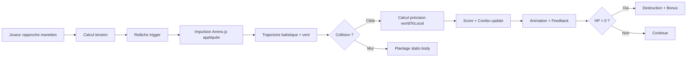

# Configuration Vite pour A-Frame et WebXR

Ce projet utilise Vite avec A-Frame pour créer une expérience de tir à l'arc en réalité étendue.

## Structure du Projet (Architecture ECS)

```
src/
├── components/          # Composants A-Frame personnalisés (Entity-Component)
│   ├── bow-logic.js          # Mécanique de l'arc avec calcul de tension
│   ├── arrow-physics.js      # Physique Ammo.js des flèches
│   ├── target-behavior.js    # Système de cibles avec précision
│   └── scene-mesh-handler.js # Gestion WebXR Scene Mesh
├── systems/            # Systèmes globaux (System)
│   ├── game-manager.js       # Cycle de jeu et spawn
│   └── combo-system.js       # Combos et multiplicateurs
├── main.js             # Point d'entrée
└── style.css           # Styles CSS
```

## Piliers de l'Écosystème A-Frame Utilisés

### 🎯 Physique et Collisions
- **aframe-physics-system** avec driver **Ammo.js**
  - CCD (Continuous Collision Detection) pour flèches rapides
  - Empêche le tunneling à travers les murs
  - Meilleur que Cannon.js pour les projectiles à haute vélocité

### 🎮 Gestion d'État
- **aframe-state-component**
  - État global réactif (score, combo, multiplicateur)
  - Binding automatique avec les entités HTML
  - Synchronisation temps réel

### 🛠️ Utilitaires
- **aframe-extras**
  - Animations avancées
  - Gestion des blends
  - Helpers de manipulation

### 🌍 WebXR Scene Mesh
- Support natif A-Frame 1.6.0+
- Composant `real-world-meshing`
- Conversion environnement réel → objets physiques

## Composants Développés

### 🏹 bow-logic Component
**Fonctionnalité** : Calcule la tension de l'arc basée sur la distance entre les deux manettes VR

**Implémentation** :
```javascript
// Distance entre manettes → tension normalisée
const distance = pos1.distanceTo(pos2)
const tension = (distance - minDistance) / (maxDistance - minDistance)

// Tir avec impulsion Ammo.js
const impulse = new Ammo.btVector3(force.x, force.y, force.z)
body.applyCentralImpulse(impulse)
Ammo.destroy(impulse) // Important: nettoyer la mémoire
```

**Caractéristiques** :
- Visualisation de la corde pendant le bandage
- Feedback haptique au tir
- Support tous contrôleurs VR (Oculus, Vive, Windows MR)

### ➡️ arrow-physics Component
**Fonctionnalité** : Physique réaliste avec Ammo.js

**Implémentation** :
```javascript
// Impulsion initiale basée sur tension
applyInitialImpulse() {
  const force = direction.multiplyScalar(speed * tension)
  const impulse = new Ammo.btVector3(force.x, force.y, force.z)
  body.applyCentralImpulse(impulse)
}

// Vent continu
applyWind(deltaTime) {
  const windForce = new Ammo.btVector3(x, y, z)
  body.applyCentralForce(windForce)
}

// Collision → plantage
onCollide() {
  this.el.removeAttribute('dynamic-body')
  this.el.setAttribute('static-body') // Fige la flèche
}
```

**Caractéristiques** :
- Trajectoire balistique réaliste (gravité Ammo)
- Simulation de vent
- Alignement automatique avec la vélocité
- Plantage dans les surfaces (dynamic → static)

### 🎯 target-behavior Component
**Fonctionnalité** : Calcul de précision via coordonnées locales

**Implémentation** :
```javascript
onArrowHit(arrowEl, impactPoint) {
  // Conversion world → local pour précision
  const localImpact = this.el.object3D.worldToLocal(impactPoint.clone())
  
  // Distance au centre (plan XY)
  const distance = Math.sqrt(localImpact.x ** 2 + localImpact.y ** 2)
  
  // Multiplicateur selon zone
  if (distance <= centerRadius) multiplier = 3.0      // Bullseye
  else if (distance <= middleRadius) multiplier = 2.0  // Milieu
  else multiplier = 1.0                                // Extérieur
}
```

**Caractéristiques** :
- 3 zones de précision (bullseye, middle, outer)
- Système de HP avec destruction
- Cibles mobiles (mouvement oscillant)
- Feedback visuel par zone

### 🌍 scene-mesh-handler Component
**Fonctionnalité** : Ancrage spatial WebXR

**Implémentation** :
```javascript
// Convertir mesh détecté → entité physique
createPhysicalSurface(meshData) {
  entity.setAttribute('geometry', { ... })
  entity.setAttribute('static-body', { shape: 'box' })
  return entity
}
```

**Caractéristiques** :
- Détection surfaces réelles (murs, sols, meubles)
- Conversion automatique en `static-body`
- Collisions physiques réalistes
- Visualisation wireframe (dev mode)

## Systèmes Développés

### 🎮 game-manager System
**Rôle** : Cycle de jeu global

**Fonctionnalités** :
- Spawn automatique de cibles (intervalle configurable)
- Gestion difficulté (easy/normal/hard)
- Tracking statistiques (précision, hits, flèches)
- Update HUD temps réel

**Configuration** :
```javascript
game-manager="spawnInterval: 5000; maxTargets: 5; difficulty: normal"
```

### 🔥 combo-system System
**Rôle** : Multiplicateurs et combos

**Fonctionnalités** :
- Détection hits consécutifs (timeout 2s)
- Multiplicateur progressif (+20% par combo, max 5x)
- Bonus bullseye (+1 combo)
- Feedback visuel 3D

**Logique** :
```javascript
// Hit dans timeout → combo continue
if (now - lastHitTime < comboTimeout) {
  combo++
  multiplier = 1.0 + (combo * 0.2) // Max 5x
}
```

## Technologies et Dépendances

### Package.json
```json
{
  "dependencies": {
    "aframe": "^1.6.0",
    "aframe-physics-system": "^4.0.1",
    "aframe-state-component": "^7.0.0",
    "aframe-extras": "^7.4.0",
    "aframe-environment-component": "^1.3.7"
  }
}
```

### Pourquoi Ammo.js ?
| Feature | Ammo.js | Cannon.js |
|---------|---------|-----------|
| CCD | ✅ Oui | ❌ Non |
| Performance | ⚡ Rapide | ⚡ Rapide |
| Projectiles rapides | ✅ Parfait | ⚠️ Tunneling |
| Complexité | 🔧 Moyenne | 🔧 Simple |

**Alternative** : `aframe-physx` pour Meta Quest 3 (performances optimales)

## Gameplay Loop



## Commandes de Développement

```bash
# Installer les dépendances
npm install

# Lancer le serveur de développement
npm run dev
# → http://localhost:5173/

# Builder pour la production
npm run build

# Prévisualiser le build
npm run preview

# Debug physique
# Dans index.html: physics="debug: true"
```

## Configuration WebXR

### Testing Desktop
1. Installer [WebXR Emulator Extension](https://github.com/MozillaReality/WebXR-emulator-extension)
2. Ouvrir DevTools → WebXR tab
3. Sélectionner un casque virtuel

### Testing Casque VR
1. **Meta Quest 3** :
   ```bash
   # Build
   npm run build
   
   # Servir via HTTPS (requis pour WebXR)
   npx serve -s dist --ssl-cert cert.pem --ssl-key key.pem
   ```

2. Accéder via navigateur Quest (Oculus Browser)
3. Appuyer sur bouton VR
4. Autoriser les permissions WebXR

## Prochaines Étapes

### Phase 1 : Core Gameplay ✅
- [x] Arc avec tension basée sur distance
- [x] Physique Ammo.js avec impulsions
- [x] Calcul précision worldToLocal
- [x] Système de combo
- [x] Spawn automatique

### Phase 2 : Immersion
- [ ] Scene Mesh réel (API WebXR Scene Understanding)
- [ ] Audio spatialisé 3D
- [ ] Effets de particules (impact, destruction)
- [ ] Vibrations haptiques avancées

### Phase 3 : Contenu
- [ ] Power-ups (flèches explosives, multi-cibles, glace)
- [ ] Modes de jeu (Entraînement, Contre-la-montre, Survie)
- [ ] Système de niveaux/progression
- [ ] Défis quotidiens

### Phase 4 : Polish
- [ ] Optimisation performances (pooling objets)
- [ ] Leaderboards en ligne
- [ ] Tutoriel interactif
- [ ] Paramètres utilisateur

## Déploiement

### Hébergeurs compatibles WebXR
- ✅ **Vercel** (HTTPS automatique)
- ✅ **Netlify** (HTTPS automatique)
- ✅ **GitHub Pages** (HTTPS automatique)
- ✅ **Firebase Hosting**

### Build Production
```bash
npm run build
# Fichiers dans dist/

# Test local
npx serve -s dist
```

### Configuration HTTPS (requis pour WebXR)
```javascript
// vite.config.js
export default {
  server: {
    https: true
  }
}
```

## Resources et Documentation

- [A-Frame Docs](https://aframe.io/docs/)
- [aframe-physics-system](https://github.com/c-frame/aframe-physics-system)
- [Ammo.js](https://github.com/kripken/ammo.js/)
- [WebXR Device API](https://www.w3.org/TR/webxr/)
- [WebXR Scene Understanding](https://immersive-web.github.io/real-world-geometry/)

## Troubleshooting

### Flèches traversent les murs
- Vérifier `physics="driver: ammo"` (pas cannon)
- Activer `debug: true` pour voir collision shapes
- Augmenter `mass` de la flèche si nécessaire

### Performances VR basses
- Limiter entités actives (max 20 flèches)
- Utiliser `static-body` pour objets immobiles
- Nettoyer entités après usage
- Considérer `aframe-physx` pour Quest 3

### Combo ne fonctionne pas
- Vérifier événements `target-hit` émis
- Confirmer `combo-system` sur `<a-scene>`
- Check timeout (2000ms par défaut)

### WebXR non détecté
- Vérifier HTTPS activé
- Tester avec WebXR Emulator
- Vérifier permissions navigateur

---

**SAE 4.02 - MMI** | Développé avec A-Frame, Vite et ❤️

